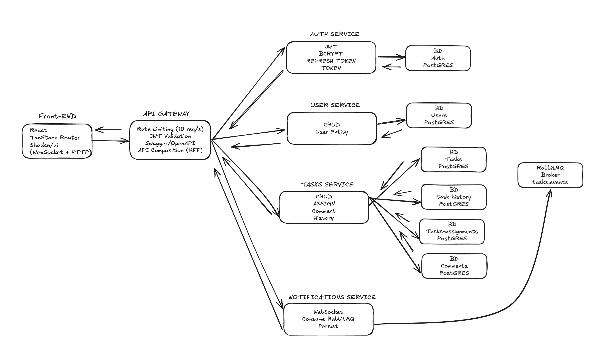

# Desafio Full-stack Júnior — Sistema de Gestão de Tarefas Colaborativo
 
## 💬 Comentários gerais

- **Dificuldades**
  - Setup inicial por ser a primeira vez usando juntos: Docker, microserviços, RabbitMQ e WebSockets.
  - Entender a lógica de packages/monorepo para compartilhar e exportar os types (ex.: `@taskmanagerjungle/types`) entre os microserviços.

- **Facilidades**
  - Após entender o fluxo de comunicação entre os serviços, o desenvolvimento de backend, frontend e regras de negócio foi fluido e intuitivo.

- **Pontos a melhorar**
  - Documentação de setup local mais detalhada: ordem de subida dos serviços, variáveis de ambiente e passos do Docker Compose.
  - Observabilidade: logs estruturados (Pino/Winston), tracing básico e métricas para facilitar troubleshooting.
  - Health checks (readiness/liveness) e endpoints de status por serviço para melhorar confiabilidade.

- **Nota final**
  - Este foi meu primeiro contato prático com microserviços e mensageria, então parte do esforço foi dedicada a aprender essas bases e como funciona o fluxo de 
  - dos conexões entre os serviços, tive uma boa experiência e aprendi muito. O uso de IA foi utilizado estrategicamente para otimizar o tempo e entender os erros 
  - que foram surgindo durante o desenvolvimento.

---

## 🏗️ Arquitetura



**Fluxo de eventos:**
1. **Task criada/atualizada** → Tasks Service publica evento no RabbitMQ.
2. **Notifications Service** consome evento, persiste notificação e emite via WebSocket.
3. **Front-end** recebe notificação em tempo real e atualiza UI.

---

## 🗂️ Entidades por Microserviço

### Auth Service (`apps/auth-service/src/entities/`)
- **`AuthEntity` (`auth`)**
  - **`id`**: `uuid`, chave primária gerada automaticamente.
  - **`email`**: `varchar(255)`, índice único.
  - **`username`**: `varchar(50)`, índice único.
  - **`passwordHash`**: `varchar(255)` com o hash da senha.
  - **`role`**: `varchar`, padrão `user`.
  - **`createdAt`** e **`updatedAt`**: `timestamptz`, geridos pelo TypeORM.

- **`RefreshToken` (`refresh_tokens`)**
  - **`id`**: `uuid`, chave primária.
  - **`userId`**: `uuid`, FK para `AuthEntity` com deleção em cascata.
  - **`tokenHash`**: `varchar(255)` com o hash do refresh token.
  - **`expiresAt`**: `timestamptz`, indexado para expiração.
  - **`revokedAt`**: `timestamptz`, opcional.
  - **`createdAt`**: `timestamptz`.
  - **`createdByIp`**: `inet`, opcional.

### Notifications Service (`apps/notifications-service/src/entities/`)

- **`NotificationsEntity` (`notifications`)**
  - **`id`**: `uuid`, chave primária.
  - **`userId`**: `uuid` identificando o destinatário.
  - **`type`**: `varchar(30)` descrevendo o tipo de evento.
  - **`payload`**: `jsonb` com os dados estruturados da notificação.
  - **`readAt`**: `timestamptz`, opcional para marcação de leitura.
  - **`createdAt`**: `timestamptz` controlado automaticamente.

### Tasks Service (`apps/tasks-service/src/entities/`)

- **`TaskEntity` (`tasks.tasks`)**
  - **`id`**: `uuid`, chave primária.
  - **`title`**: `varchar(160)` obrigatório.
  - **`description`**: `text`, opcional.
  - **`priority`**: `varchar(10)` com valores de `TaskPriority` (`LOW`, `MEDIUM`, `HIGH`, `URGENT`).
  - **`status`**: `varchar(15)` com valores de `TaskStatus` (`TODO`, `IN_PROGRESS`, `REVIEW`, `DONE`).
  - **`dueDate`**: `timestamptz`, opcional.
  - **`createdById`**: `uuid` do autor.
  - **`assignees`**: array de `uuid` listando responsáveis atuais.
  - **`createdAt`** e **`updatedAt`**: `timestamptz` com padrão `now()`.
  - **Relacionamentos**: `OneToMany` com `CommentEntity`, `TaskAssignmentEntity` e `TaskHistoryEntity`.

- **`CommentEntity` (`tasks.comments`)**
  - **`id`**: `uuid`, chave primária.
  - **`taskId`**: `uuid`, FK para `TaskEntity`.
  - **`authorId`**: `uuid` do autor do comentário.
  - **`content`**: `text` com a mensagem.
  - **`createdAt`**: `timestamptz` com padrão `now()`.
  - **Relacionamentos**: `ManyToOne` para `TaskEntity`, com deleção em cascata.

- **`TaskAssignmentEntity` (`tasks.task_assignments`)**
  - **`id`**: `uuid`, chave primária.
  - **`taskId`**: `uuid`, FK para `TaskEntity`.
  - **`userId`**: `uuid` do usuário atribuído.
  - **`assignedById`**: `uuid` de quem realizou a atribuição.
  - **`assignedAt`**: `timestamptz` com padrão `now()`.
  - **`unassignedAt`**: `timestamptz`, opcional.
  - **`isActive`**: `boolean` indicando atribuições vigentes.
  - **Relacionamentos**: `ManyToOne` para `TaskEntity`.

- **`TaskHistoryEntity` (`tasks.task_history`)**
  - **`id`**: `uuid`, chave primária.
  - **`taskId`**: `uuid`, FK para `TaskEntity`.
  - **`userId`**: `uuid` do usuário que provocou a alteração.
  - **`action`**: `varchar(50)` com valores de `TaskHistoryAction`.
  - **`oldValue`** e **`newValue`**: `jsonb`, opcionais.
  - **`createdAt`**: `timestamptz` com padrão `now()`.
  - **Relacionamentos**: `ManyToOne` para `TaskEntity`, com deleção em cascata.

### User Service (`apps/user-service/src/entities/`)

- **`UsersEntity` (`users.users`)**
  - **`id`**: `uuid`, chave primária.
  - **`name`**: `varchar(160)`.
  - **`birthday`**: `timestamp with time zone`.
  - **`document`**: `varchar(20)`.
  - **`email`**: `varchar(160)`.
  - **`role`**: `varchar(160)`.
  - **`createdById`**: `uuid` de quem realizou o cadastro.
  - **`created_at`** e **`updated_at`**: timestamps automáticos.

## Decisões técnicas e trade-offs

### Arquitetura & Bounded Contexts

>>Microserviços por domínio: auth, tasks, notifications, api-gateway.
>
>✅ Escala e deploy independentes, time boundaries claros.
> 
>❌ Complexidade operacional maior (observabilidade, tracing, contratos de eventos).
>
>>DB por serviço (mesmo cluster ou instâncias separadas): sem FK cruzado.
>
>✅ Autonomia de schema/migrations, isolamento de falhas.
 
### Comunicação & Consistência
 
>> Sync (RPC/HTTP) para validação on-write + Async (RabbitMQ) para eventos.
>
>✅ Boa UX/comportamento previsível (validações imediatas) e baixo acoplamento (events).
> 
>❌ Dupla via aumenta complexidade (retries, circuit breaker, idempotência).
>
>>Outbox Pattern para publicar eventos de maneira transacional.
>
>✅ Evita “lost updates” entre DB e broker.
> 
>❌ Requer worker/cron e tabela extra.
>
>>Sagas/Compensações para operações multi-serviço (ex.: criação + atribuições).
>
>✅ Evita 2PC; tolera falhas.
> 
>❌ Modelagem mais trabalhosa e eventual consistency.
> 
>### Mensageria
> 
>RabbitMQ (topic exchange tasks.events).
> 
>✅ Entrega ordenada por fila, roteamento flexível, ecosistema maduro.
>❌ Manter DLQ, reprocessamento e monitoramento.
>
>>Eventos canônicos (ex.: task.created, task.updated, task.commented).
> 
>✅ Evita acoplamento ao schema interno de cada serviço.
> 
>❌ Evoluções exigem versionar payloads.
> 
>### WebSocket & Notificações
> 
>>WS concentrado no notifications-service (ou via Gateway como proxy).
> 
>✅ Responsabilidade única (subscribe, broadcast, read receipts).
> 
>❌ Exige identificação de usuários e multiplex de canais.
>
>### Persistência
>
>>PostgreSQL + TypeORM (requisito do desafio).
>
>✅ SQL robusto, JSONB para audit e payloads de evento, ecosistema amplo.
>
>>Histórico (audit) via tabela `task_history` (before/after JSONB).
>
>✅ Observabilidade de mudanças.
>❌ Tamanho do banco cresce; considerar retenção/particionamento.
>
>### API Gateway
>
>>BFF/API Composition para enriquecer respostas (tasks + usuários em batch).
>
>❌ Necessita tuning em produção.
>
>### Front-end
>
>>React + TanStack Router + shadcn/ui + Tailwind.
>
>✅ UI rápida de construir, design consistente.
> 
>❌ Curva de aprendizado do Router + design system custom.
>
>>Estado: Zustand para sessão; TanStack Query para dados (diferencial).
>
>✅ Cache, revalidações, mutations com optimistic updates.
> 
>❌ Requer política de invalidação clara.
>
>Validação: react-hook-form + zod.
>
>✅ Tipagem end-to-end, UX de formulários.
> 
>❌ Schemas precisam acompanhar DTOs do backend.
>
>### Observabilidade
>
>Logs estruturados (Pino/Winston) + correlação (requestId).
>
>✅ Depuração entre serviços.
> 
>❌ Precisa log routing (ELK/Datadog) em produção.
>
>>Health-checks (/health) + probes Docker.
>
>✅ Alertas rápidos.
> 
>❌ Health "verde" não garante dependências (precisa deep checks opcionais).
>
>### Testes
>
>>Unitários (Jest) em serviços críticos + e2e básicos no Gateway.
>
>✅ Confiança em refactors.
> 
>❌ Tempo extra na entrega do desafio; priorizar fluxos core.
>
>### Segurança & Config
>
>>CORS restrito, Helmet, DTO validation em todos endpoints.
>
>✅ Minimiza superfície.
> 
>❌ Pode quebrar se o front mudar domínios.
>
>>Secrets via .env no desafio; Vault/SM em produção.
>
>✅ Simplicidade no teste.
> 
>❌ Não versionar segredos; cuidar de exemplos .env.example.
>
>### Deploy & DX
> 
>>Docker Compose para rodar tudo local.
>
>✅ Um comando sobe stack inteira.
> 
>❌ Build multi-stage e volumes precisam cuidado em Macs (FS lento).
>
>>Hot reload local + containers só para db/rabbit no dia a dia.
>
>✅ Iterações mais rápidas no macOS.
> 
>❌ Divergência pequena entre local e container completo.

## Problemas conhecidos e melhorias futuras

### Problemas conhecidos
- **Eventual consistency**: Notificações podem chegar com delay se o broker estiver sobrecarregado.
- **Falta de retry/DLQ**: Eventos que falham no processamento não têm reprocessamento automático configurado.
- **Sem tracing distribuído**: Dificulta debug de fluxos entre múltiplos serviços.
- **Validação de schema de eventos**: Não há validação formal (ex.: JSON Schema) dos payloads publicados no RabbitMQ.

### O que melhoraria
1. **Observabilidade completa**:
   - Adicionar OpenTelemetry para tracing distribuído.
   - Centralizar logs com ELK Stack ou Datadog.
   - Métricas com Prometheus + Grafana.

2. **Resiliência**:
   - Implementar circuit breaker (ex.: com `@nestjs/circuit-breaker`).
   - Configurar Dead Letter Queue (DLQ) no RabbitMQ para eventos com falha.
   - Políticas de retry exponencial com backoff.

3. **Testes**:
   - Aumentar cobertura de testes unitários (>80%).
   - Adicionar testes de contrato (Pact) entre serviços.
   - Testes e2e com Playwright para fluxos críticos do front.

4. **Segurança**:
   - Rotação automática de secrets com Vault/AWS Secrets Manager.
   - Rate limiting por usuário (não apenas global).
   - Auditoria de acessos e GDPR compliance.

5. **Performance**:
   - Cache Redis para queries frequentes (ex.: lista de tarefas).
   - Paginação cursor-based para listas grandes.
   - Compressão de payloads HTTP (gzip/brotli).

---

## Tempo gasto

| Etapa                                                                                                | Tempo estimado |
|------------------------------------------------------------------------------------------------------|----------------|
| **Setup inicial** (Docker, monorepo, configs)                                                        | ~8h            |
| **Auth Service** (JWT, bcrypt, refresh token)                                                        | ~2h            |
| **User Service** (CRUD básico)                                                                       | ~2h            |
| **Tasks Service** (CRUD, assignments, comments, history)                                             | ~3h            |
| **Notifications Service** (RabbitMQ consumer, WebSocket) - Uso de IA para configuração dos serviços  | ~3h            |
| **API Gateway** (routing, composition, rate limiting, Swagger)                                       | ~3h            |
| **Front-end** (React, TanStack Router, shadcn/ui, forms, WebSocket) Uso de IA para criação do kanabn | ~10h           |
| **Integração e testes** (debug, ajustes de fluxo)                                                    | -              |
| **Documentação** (README, comentários, diagramas)                                                    | ~2h            |
| **Total**                                                                                            | **~37h**       |

**Nota**: Parte significativa do tempo foi dedicada ao aprendizado de microserviços, RabbitMQ e WebSockets, tecnologias que usei pela primeira vez neste projeto.

---
# Instruções
## Como rodar o projeto

### Pré-requisitos
- **Node.js** 18+ e **pnpm** ou **yarn**
- **Docker** e **Docker Compose**

### Passos

1. **Clone o repositório**:
   ```bash
   git clone <repo-url>
   cd TaskManagerJungle
   ```

2. **Instale as dependências**:
   ```bash
   npm install
   ```

3. **Configure as variáveis de ambiente**:
   - Copie os arquivos `.env.example` de cada serviço para `.env` e ajuste conforme necessário.
   - Exemplo:
     ```bash
     cp apps/auth-service/.env.example apps/auth-service/.env
     cp apps/api-gateway/.env.example apps/api-gateway/.env
     # Repita para os demais serviços
     ```

4. **Suba os serviços com Docker Compose**:
   ```bash
   docker-compose up -d
   ```
   Isso iniciará:
   - PostgreSQL (portas 5432, 5433, 5434 para cada serviço)
   - RabbitMQ (porta 5672, management UI em 15672)
   - Todos os microserviços (auth, user, tasks, notifications, api-gateway)
   - Front-end (porta 3000)

5. **Acesse a aplicação**:
   - **Front-end**: http://localhost:3000
   - **API Gateway (Swagger)**: http://localhost:4000/api/docs
   - **RabbitMQ Management**: http://localhost:15672 (user: `guest`, password: `guest`)

6. **Para desenvolvimento local** (hot reload):
   ```bash
   # Suba apenas os bancos e o RabbitMQ
   docker-compose up -d postgres-auth postgres-users postgres-tasks rabbitmq
   
   # Rode os serviços localmente
   npm run dev:auth
   npm run dev:users
   npm run dev:tasks
   npm run dev:notifications
   npm run dev:gateway
   npm run dev:frontend
   ```

### Migrations

Para rodar as migrations do TypeORM:
```bash
npm run migration:run --workspace=apps/auth-service
npm run migration:run --workspace=apps/user-service
npm run migration:run --workspace=apps/tasks-service
```

---

## Endpoints principais

Consulte a documentação completa no **Swagger**: http://localhost:4000/api/docs
>> Base Prefix **/api**
### Auth
- `POST /auth/login` - Login (retorna accessToken e refreshToken)
- `POST /auth/validate` - Validar accessToken
- `POST /auth/refresh` - Renovar accessToken

### User
- `GET /user` - Listar todos os usuários do sistema
- `GET /user/profile` - Retorna dados do usuário logado
- `GET /user/:id` - Retorna dados de um usuário específico pelo ID
### Tasks
- `GET /tasks` - Listar todas as tarefas com dados dos usuários
- `GET /tasks/user/:userId` - Listar tarefas de um usuário específico
  - `?includeAssigned=true` - Incluir tarefas atribuídas ao usuário
- `GET /tasks/:taskId` - Obter detalhes de uma tarefa específica
- `POST /tasks` - Criar uma nova tarefa
- `PUT /tasks` - Atualizar uma tarefa existente
- `GET /tasks/:id/comments` - Listar comentários de uma tarefa
  - `?page=` - Número da página (padrão: 1)
  - `?size=` - Itens por página (padrão: 10)

### Task History (Histórico de Tarefas)
- `GET /tasks-history/task/:taskId` - Obter histórico de alterações de uma tarefa
  - Retorna uma lista de entradas de histórico com:
    - `action`: Ação realizada (criada, atualizada, etc.)
    - `field`: Campo alterado (se aplicável)
    - `oldValue`: Valor antigo (se aplicável)
    - `newValue`: Novo valor (se aplicável)
    - `userName`: Nome do usuário que realizou a ação
    - `userEmail`: Email do usuário que realizou a ação
    - `createdAt`: Data e hora da alteração

### Notifications
- `GET /notifications` - Listar notificações do usuário
- `PATCH /notifications/:id/read` - Marcar como lida
- WebSocket: `ws://localhost:4001` (requer token JWT)

### Health Check
- `GET /health` - Verificar status de todos os serviços
- `GET /health/auth` - Verificar status do serviço de autenticação
- `GET /health/tasks` - Verificar status do serviço de tarefas
- `GET /health/notifications` - Verificar status do serviço de notificações
- `GET /health/users` - Verificar status do serviço de usuários
- `GET /health/postgres` - Verificar conexão com o PostgreSQL
- `GET /health/rabbitmq` - Verificar conexão com o RabbitMQ
---
